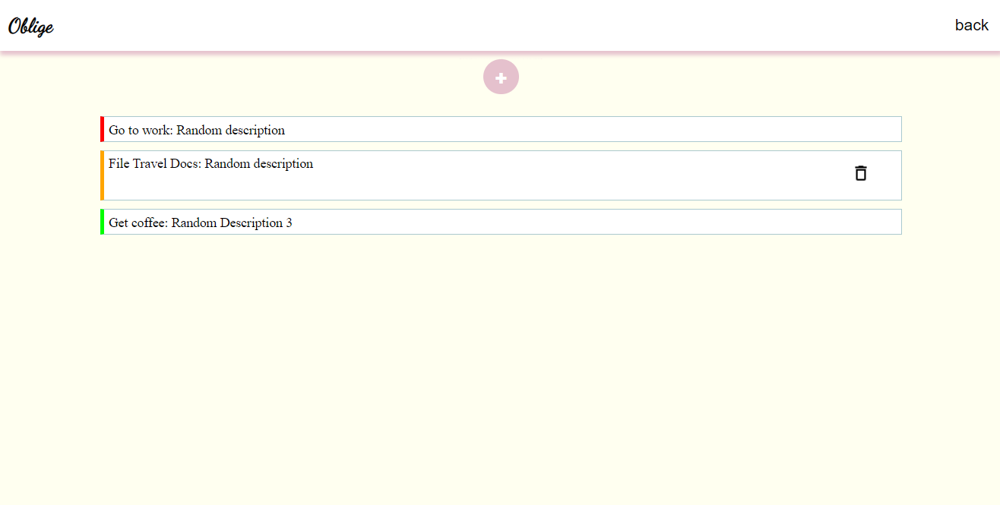

# To-do List
This is a simple web app for keeping track of your daily tasks.

## Built with
* Vanilla JS
* HTML
* CSS
### [Live on gh-pages](https://somtojf.github.io/Todo-List/)
## Getting Started
In order to setup and work on this project on your own, you will need to:
1. [Fork and Clone](https://docs.github.com/en/desktop/contributing-and-collaborating-using-github-desktop/adding-and-cloning-repositories/cloning-and-forking-repositories-from-github-desktop) this project
2. Once you have cloned this project, you can install the required dependencies by using: ```npm install```
3. A live demo of the project can be started by using: ```npm start```
4. Distribution files can be produced using: ```npm run build```
## Usage
1. Once you're on the home page, select one of three different types of list depending on what type of task you want to add or view.
2. When you click a list type you'll be able to see different tasks you have previously stored in that list and or add/delete tasks.
3. To Delete a task, tap on a task after which it will expand and a button with a 'bin' icon will appear. Click on the bin Icon to delete that particular task.
4. To add a Task, Click on then Add task button and Fill the popup form. You do not need to fill the description field but all other fields are required.
Also Note that:
* The Title field has a maximum of 50 characters.
* The description field has a maximum of 150 characters.
## Contributions 🤝
Contributions, Issues and feature requests are very much welcome!
## Show your Support
If you got until here, show your love hitting the ⭐️ button, I'd really appreciate it.